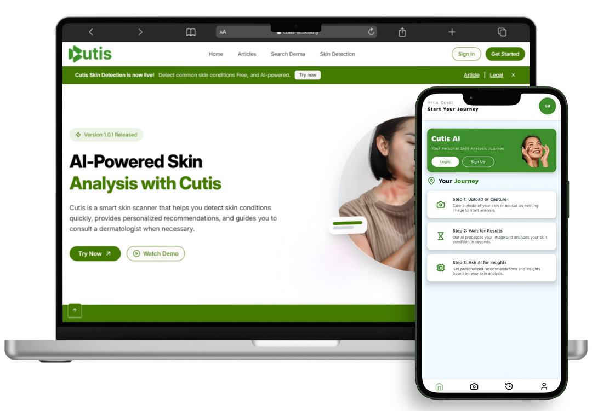
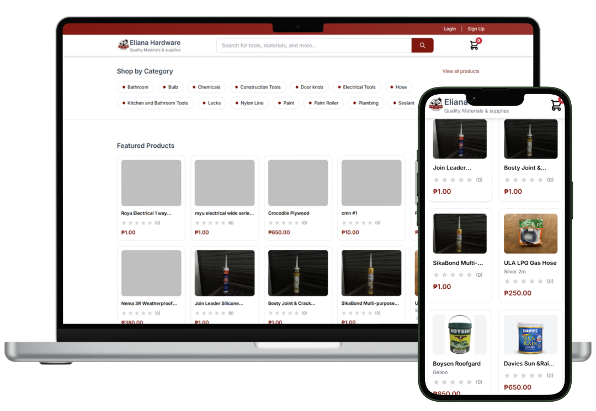
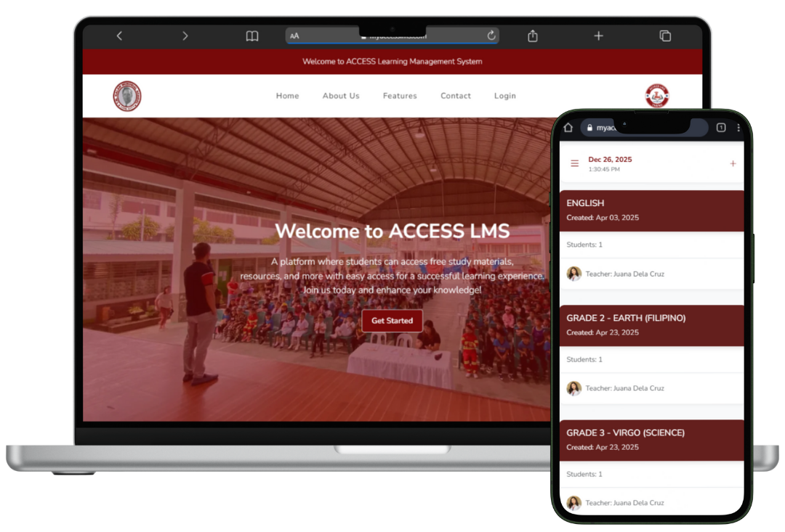
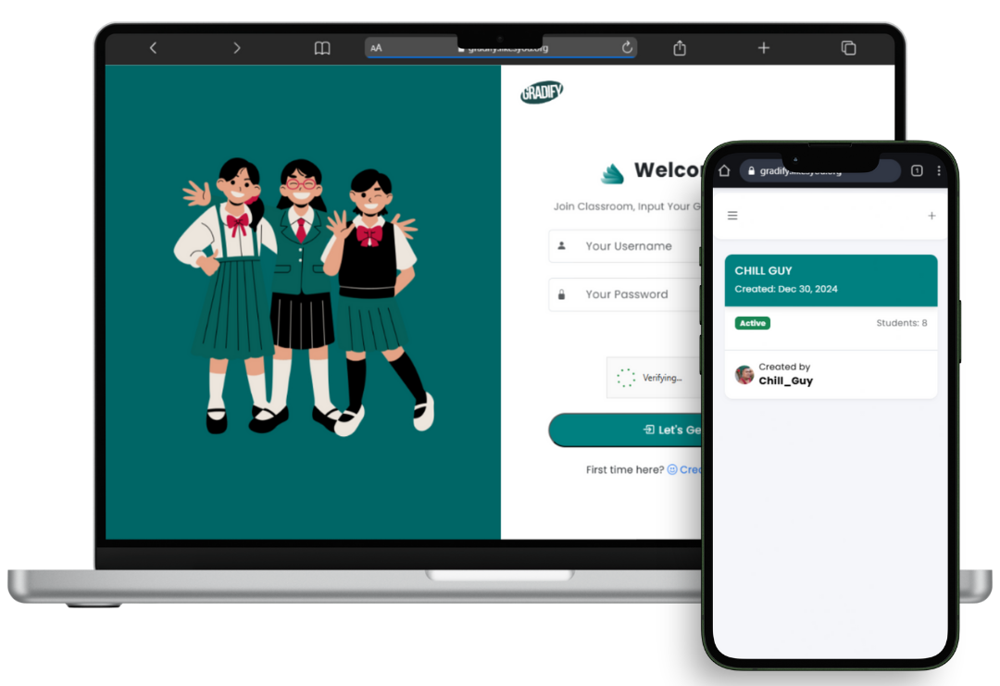

<table width="100%">
<tr>
<td width="55%" valign="middle">
  
 &nbsp;**Hi, Welcome**

```
Digital Craftsman
Developer · Designer · Learner
```

I build things for the web — clean code,
thoughtful UI. Below is some things
I Did in the past

[](https://github.com/Ajutzu?tab=followers)&nbsp;[](https://github.com/Ajutzu?tab=repositories&sort=stargazers)

</td>
<td width="45%" valign="middle" align="center">

<picture>
  <source media="(prefers-color-scheme: dark)" srcset="https://streak-stats.demolab.com?user=Ajutzu&theme=dark&hide_border=true&background=00000000&ring=1155ba&fire=488207&currStreakLabel=1155ba" />
  
</picture>

</td>
</tr>
</table>

<table width="100%">
<tr>
<td width="33.33%" valign="top">

**CUTIS – AI SKIN DETECTION**

<br/>

AI-powered web and mobile app for detecting common skin conditions using computer vision.


[](https://www.cutis-ai.beauty/)

</td>

<td width="33.33%" valign="top">

**ELIANA HARDWARE STORE**

<br/>

Freelance-built e-commerce platform with delivery management and map-based driver tracking.


[](https://www.eliana-hardware.store/)

</td>

<td width="33.33%" valign="top">

**VILLA JOVITA RESORT**

<br/>

Resort booking platform with real-time chat, ratings, and admin panel.


[](https://villa-jovita-resort.com/index.php)

</td>
</tr>

<tr>

<td width="33.33%" valign="top">

**ACCESS LMS**

<br/>

Role-based LMS for managing courses, classrooms, and schedules.


[](https://myaccesslms.com/)

</td>

<td width="33.33%" valign="top">

**TREKTRIBE – RUN, RIDE & COMPETE**

<br/>

Route generation, activity tracking, and gamified leaderboard platform.


[](https://trektribe.wuaze.com/)

</td>

<td width="33.33%" valign="top">

**GRADIFY – STUDENT RANKING SYSTEM**

<br/>

Academic ranking system with GWA computation and class rankings.


[](https://gradify.likesyou.org/)

</td>

</tr>

</table>

<div align="center">

`Building in public · Open to collabs · Always learning`

[](https://ajcastillo.vercel.app)

</div>
