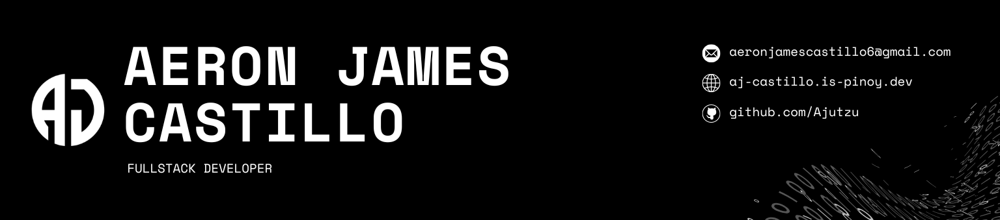

  

  
  
  

I'm a web and mobile developer passionate about building modern, responsive, and user-focused digital experiences. I enjoy turning ideas into functional applications—from polished front-end interfaces and full-stack web platforms to mobile applications and cloud-deployed systems.

My development journey has led me to work with modern JavaScript frameworks, backend technologies, databases, cloud infrastructure, and DevOps tools. I also enjoy exploring new technologies and continuously improving my skills as a software developer.

> 💡 **I build things, break things, learn from them, and build them better.**

  

  
  
  

  <i>Thanks for visiting my profile! ⭐ Feel free to explore my repositories.</i>

